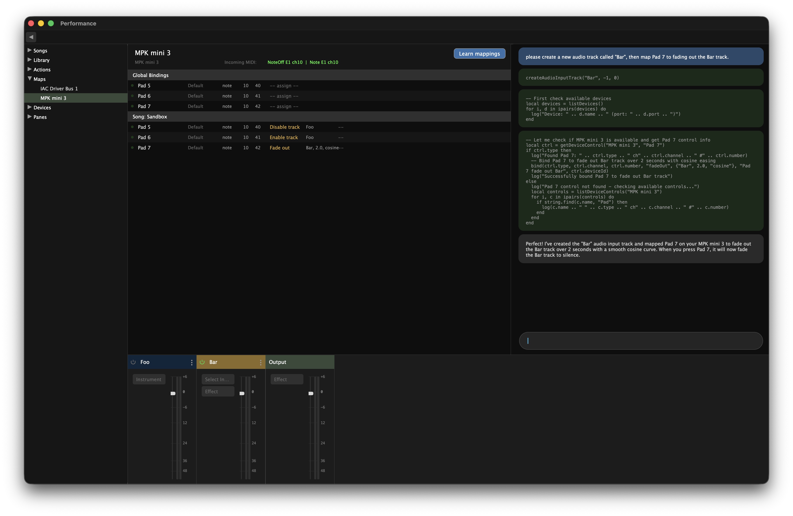

# Performance

A scriptable live music performance environment for macOS. Route MIDI controllers and live audio through Audio Unit plugins, bind physical controls to actions, and let an AI copilot modify the environment while you play.



## What it does

Performance is a live environment — always running, always ready. You build songs from virtual instrument tracks, audio input tracks, effects chains, busses, and sends. MIDI controllers bind to actions like track switching, fades, and crossfades. An embedded Claude assistant can modify the environment in real time via Lua while you play.

## Key features

- **Instrument and audio input tracks** with AU plugin hosting, effects chains, sends, and per-track gain
- **Stereo VU meters** with IEC-style non-linear dB scale, peak hold with exponential decay
- **MIDI device mapping** with Learn mode — map physical controls, assign actions, build score sequences
- **Bindings system** — MIDI controls trigger named actions (fade, crossfade, track switch) with song-scoped and global scope
- **Custom Lua actions** — composable macros for complex multi-step transitions, created by Claude or by hand
- **Audio device management** — independent input/output device selection, hot-swappable, persisted
- **Song management** — named sessions with independent tracks, busses, bindings, and scores. Sandbox session for experimentation.
- **Embedded Claude chat** — AI assistant with tool use that modifies the live environment via Lua. Sees track state, device mappings, and the full API.
- **Persistence** — SQLite saves everything: tracks, instruments, effects, processor state, bindings, device mappings. Restore exactly where you left off.
- **Flexible UI** — sidebar (songs, library, maps, devices, panes), dual content panes (mapping editor, debug, logs, chat), collapsible mixer

## Architecture

In-memory state store (StateAPI) is the single source of truth at runtime. All mutations flow through it. An event bus notifies the engine sync layer, which applies changes to the JUCE AudioProcessorGraph. SQLite is the persistence layer — loaded on startup, saved on quit and on demand.

Three APIs: **StateAPI** (all state reads/writes), **EngineAPI** (peak levels, processors, plugin UI), **PerformanceCoordinator** (lifecycle, orchestration, action dispatch).

See [CLAUDE.md](CLAUDE.md) for full architecture documentation.

## Building

Requires macOS, Xcode command line tools, and CMake.

```bash
mkdir build && cd build
cmake ..
cmake --build .
```

Launch: `open Performance_artefacts/Debug/Performance.app`

## Testing

```bash
cd build
./PerformanceTests_artefacts/Debug/PerformanceTests
```

76 tests covering state management, persistence round-trips, engine sync, and audio device configuration.

## Tools

- `bin/perf` — send Lua commands to the running app via IPC
- `bin/midi-test` — send test MIDI notes via a virtual port
- `bin/midi-loop` — continuous MIDI note sending for testing
- `bin/reset` — reset all state (preserves device mappings)

## Tech stack

- **C++17** with JUCE framework
- **Audio Units** for plugin hosting
- **Lua** (sol2) for scripting and custom actions
- **SQLite** for persistence
- **Claude API** for embedded AI assistant

## Status

Active development. Solo project by Will Haslett, built entirely with Claude.
